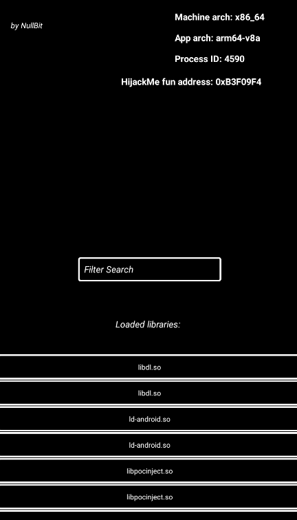

#An app to test your library injections on.

**Intro**
This app iterates over proc/self/maps to list all loaded libraries which you can inspect and test your own
library injection on.

**Build**
Either build it yourself or download apk from releases for your preferred ABI
in the outputs it will have 4 different apks for architectures armeabi-v7a arm64-v8a x86 and x86_64

**Additional things**: It has a HijackMe function which is called ever 0.5 seconds you can play around with that function also theres another
Test function in libpocinject

